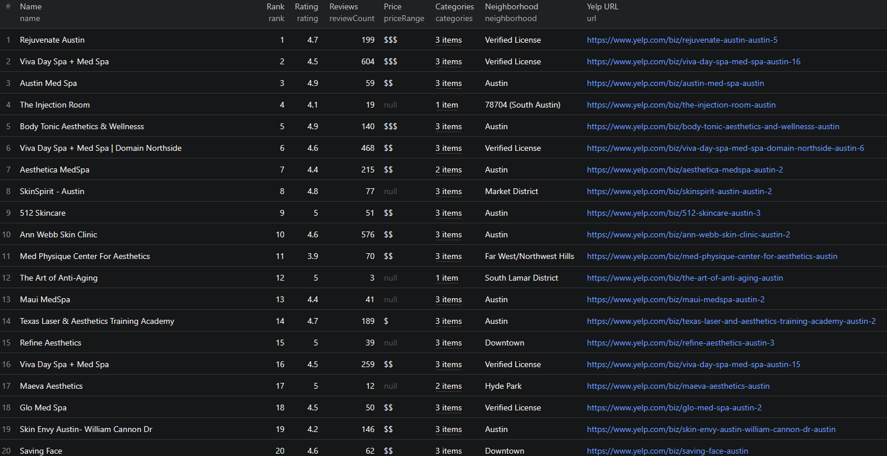

# How to Scrape Yelp Business Listings in Node.js

A minimal Node.js example that scrapes Yelp business listings by calling the [Yelp Business Scraper](https://apify.com/piotrv1001/yelp-business-scraper) Apify actor. You don't build a scraper from scratch here — the actor handles the crawling, parsing, and anti-blocking, and you just call it and read the results.



## What this example does

- Calls the `piotrv1001/yelp-business-scraper` Apify actor
- Passes a search input (a search term and location)
- Waits for the run to finish
- Fetches the results from the run's dataset
- Prints each business listing to the console

## Prerequisites

- [Node.js](https://nodejs.org/) 18 or newer
- An [Apify account](https://console.apify.com/sign-up) (free tier works)
- Your Apify API token — find it in the [Apify Console](https://console.apify.com/account/integrations)

## Installation

```bash
npm install
```

## Environment setup

Copy the example env file and add your Apify API token:

```bash
cp .env.example .env
```

Then edit `.env`:

```env
APIFY_TOKEN=your_apify_token_here
```

## Usage

```bash
npm start
```

## Code example

```js
import { ApifyClient } from 'apify-client';
import 'dotenv/config';

// Initialize the ApifyClient with your Apify API token
// Set APIFY_TOKEN in your .env file (copy .env.example to get started)
const client = new ApifyClient({
    token: process.env.APIFY_TOKEN,
});

// Prepare Actor input
const input = {
    "search": "Sushi",
    "location": "New York, NY"
};

// Run the Actor and wait for it to finish
const run = await client.actor("piotrv1001/yelp-business-scraper").call(input);

// Fetch and print Actor results from the run's dataset (if any)
console.log('Results from dataset');
console.log(`💾 Check your data here: https://console.apify.com/storage/datasets/${run.defaultDatasetId}`);
const { items } = await client.dataset(run.defaultDatasetId).listItems();
items.forEach((item) => {
    console.dir(item);
});

// 📚 Want to learn more 📖? Go to → https://docs.apify.com/api/client/js/docs
```

## Example output

See [`sample-output.json`](./sample-output.json) for a full example of what the actor returns. Each business listing includes key fields such as:

- `name`, `alias`, `url` — business identity and Yelp page
- `rating`, `reviewCount`, `reviewCountText` — review metrics
- `priceRange`, `categories`, `neighborhood` — classification
- `reviewSnippet`, `thumbnail` — a preview review and image
- `phone`, `address`, `website` — contact details
- `rank`, `scrapedAt` — result position and timestamp

## Use cases

- Build a local restaurant or business directory
- Generate sales leads from businesses in a target city
- Monitor ratings and review counts of competitors
- Enrich a CRM with phone numbers, addresses, and websites
- Power market research on a category or neighborhood

## Try the actor on Apify

**[Open the Yelp Business Scraper on Apify](https://apify.com/piotrv1001/yelp-business-scraper)**

## Related resources

- Blog post: [How to Scrape Yelp Business Listings](https://www.falconscrape.com/blog/how-to-scrape-yelp-business-listings)

## License

MIT
